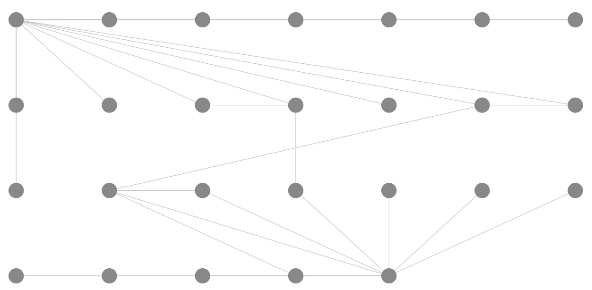
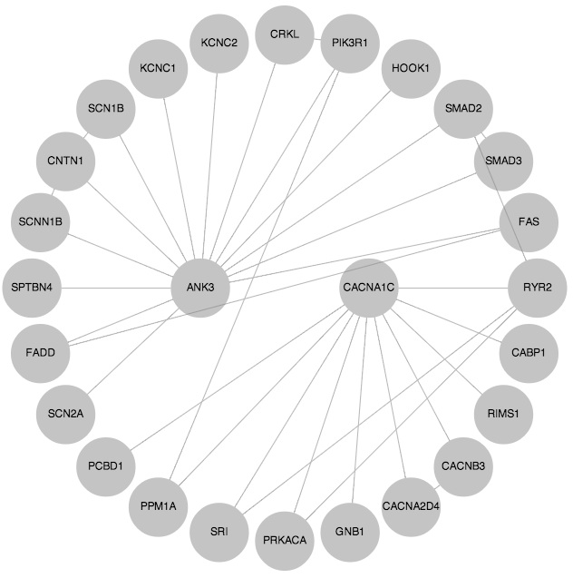

#Visualizing graphs with Cytoscape.js

Cytoscape is a graph visual analytics tool that was was originally developed for
use with biological data.
In fact, I probably originally extracted the example graph using a plugin from
the MiMI database in the Java implementation of
[Cytoscape](http://www.cytoscape.org/).
The JavaScript version of [cytoscape.js](http://cytoscape.github.io/cytoscape.js/)
follows the spirit of Cytoscape, and provides more analytical capabilities than
the other libraries considered.

The library uses jQuery, so you'll have to include the dependency when you use
cytoscape.js.
Here, we'll just include a script tag in the html file.

##Getting started

*All OS specific instructions assume a Unix-based system, and are written based on
using Mac OS X.*

To get started, we'll create a directory `cytoscapejs` as a sandbox, and do a local
install of cytoscape.js and a basic webserver using `npm`.
So, at the command line run the commands

    mkdir cytoscapejs
    cd cytoscapejs
    npm init
    npm install cytoscape --save-dev
    npm install http-server --save-dev

The `npm install` commands will place sigma.js in the local `node_modules` directory, with
minified code in the `dist` subdirectory – so running `node`, you can
require `cytoscape.min.js` to use it.

##A Basic Page

    <!DOCTYPE html>
    <html>
      <head>
        
        
        
        
      </head>
      <body>
        

      </body>
    </html>

##A session

Each graph is represented by a session instance.
We start by creating the session instance and attaching it to a DOM element
we'll call `cy`.

    var cy = cytoscape({
      container: document.getElementById('cy'),
      ready: function(){}
    });

When we add nodes and edges to this object, then the graph will be displayed to
the web page based on the style attached to `cy`.

The  `ready` property is a call-back function that is called when the object is
"ready".
(Be sure to read the documentation before putting effort into this call-back.
  Some things can go there, and some cannot because ready only means that some
  things are ready.)

##A graph

A graph is specified in terms of its vertices ("nodes") and its edges.
Each is a `data` object with particular properties.
For instance a node must minimally indicate an identifier and would be of the form

    { data: { id: 'a1'} }

In our case, the nodes will look like

    { data: { id: 'n1', name: 'ANK3' } }

where the `name` property indicates the name of the protein.

An edge is similar, but only needs to have `source` and `target` properties to
indicate the IDs of the source and target of the edge.
We can also specify an `id`, but it is not mandatory like for a node.
An edge from our example is

    { data: { id: 'e1', source: 'n1', target: 'n2' } }

Since they are just JS objects, both nodes and edges can have other properties
for use in visualization and analysis.

We are going to specify the whole graph using an object consisting of two lists:
a list of nodes and a list of edges.
A subgraph from our example is

    var graphelements = {
        nodes: [
          { data: { id: 'n1', name: 'ANK3'   } },
          { data: { id: 'n2', name: 'SCN2A'  } },
          { data: { id: 'n3', name: 'FADD'   } },
          { data: { id: 'n4', name: 'FAS'    } },
          { data: { id: 'n5', name: 'SCNN1B' } }
        ],
        edges: [
          { data: { id: 'e1', source: 'n1', target: 'n2' } },
          { data: { id: 'e2', source: 'n1', target: 'n3' } },
          { data: { id: 'e3', source: 'n1', target: 'n4' } },
          { data: { id: 'e4', source: 'n1', target: 'n5' } }
        ]
     };

which can be added to our session object using the command

    cy.load(graphelements);

After the nodes and edges are loaded, we can then manipulate the object, and if
your script is being executed in the browser, the graph will be rendered.
(We can specify the layout for rendering the object as well.)

Nodes and vertices can also be given in a list, where each is labeled by whether
it is a node or vertex as in the following.

    cy.add([
      { group: 'nodes', data: { id: 'n1', name: 'ANK3'   } },
      { group: 'edges', data: { id: 'n2', name: 'SCN2A'  } },
      { group: 'edges', data: { id: 'e1', source: 'n1', target: 'n2' } }
    ]);

We can also add individual elements such as in

    cy.add({ data: { id: 'n6', name: 'CNTN1' }});

##Layout

By default Cytoscape.js displays the graph using a grid layout, which looks like
this

Unfortunately, some of the edges overlay others, and so we need to find another
layout that shows the structure of the graph better.

The BFS layout with our two seed vertices as roots seems like a good candidate.

    var opt = {
      name: 'breadthfirst',
      circle: true,
      roots: ['n1','n26']
     };

    cy.layout(opt);

The version of the layout that I downloaded has a bug and wont actually take an
array of nodes, but fixing the bug gives

which is not quite the same as the original hand drawn graph, but is closer than
the grid layout.

To get the protein names, we add a style property to the constructor options:

    var cy = cytoscape({
      container: document.getElementById('cy'),
      style: cytoscape.stylesheet()
          .selector('node')
            .css({
              'content': 'data(name)',
              'font-family': 'helvetica',
              'font-size': 11,
              'text-valign': 'center',
              'color': '#000',
              'width': 60,
              'height': 60
            }),
      ready: function(){}
    });

We can also set edge style by continuing the chain of method calls, but using the
`edge` selector instead.

The other libraries give the best layout using the force directed layout, which
in cytoscape is provided by the `arbor` layout.
To use `arbor`, you have to explicitly use the `arbor.js` script located in the
`lib` subdirectory of `node_modules`, change the definition of `opt` to

    var opt = { name: 'arbor' }

and you also have to fire up a server.
This should be possible by running `npm start` and then visiting `localhost:8000`,
but I have not gotten it to do more than show a fraction of the graph yet.

##Finding Cytoscape.js

- [cytoscape.js](http://cytoscape.github.io/cytoscape.js/)
- [cytoscape.js repo](https://github.com/cytoscape/cytoscape.js)
