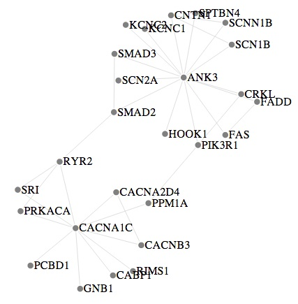

#Visualizing graphs with D3

D3 is a general visualization framework, in which most of the visualizations
follow a similar convention.
To D3, a graph is just a force layout, and that's about it.
So, forget about other layouts, graph algorithms or anything graph like.

##Getting started

*All OS specific instructions assume a Unix-based system, and are written based on
using Mac OS X.*

To get started, we'll create a directory `d3` as a sandbox, and do a local
install of D3 using `npm`.
At the command line run the commands

    mkdir d3
    cd d3
    npm init
    npm install d3 --save-dev

The `npm install` commands will place d3 in the local `node_modules` directory, with
minified code in the `d3` subdirectory – so running `node`, you can
require `d3.min.js` to use it.

##A Basic Page

    <!DOCTYPE html>
    <meta charset="utf-8">
    <style>

    .node {
      stroke: #fff;
      stroke-width: 1.5px;
    }

    .link {
      stroke: #999;
      stroke-opacity: .6;
    }

    </style>
    <body>
      <script src="node_modules/d3/d3.min.js"></script>
      <script src="examplegraph.js"></script>
    </body>

##A graph

A graph is specified as an object with properties `nodes` and `edges`, which are
arrays of node objects and edge objects.
A node simply has a name, so could be given as an object like

    { name: 'ANK3' }

while an edge has an ID and a source and target.
Unlike the other libraries the source and target are the index of the nodes in
the `nodes` array.
So an edge would look like

    { id: 'e1', source: 0, target: 1 }

A fragment of our graph then looks like

    var graphdata = {
      nodes: [
        { name: 'ANK3' },
        { name: 'SCN2A' },
        { name: 'FADD' }
      ],
      edges: [
        { id: 'e1', source: 0, target: 1 },
        { id: 'e2', source: 0, target: 2 }
      ]
    };

##The setup

Since D3 is a general visualization scheme we have a lot more control over how
things are displayed than with the dedicated frameworks.
This means we need to setup our canvas for drawing.

```
var w = 960;
var h = 500;

var colors = d3.scale.category20();

var svg = d3.select("body").append("svg")
    .attr("width", w)
    .attr("height", h);
```

The layout is handled by a force object that we modify to set the forces used
in the layout.

```
var force = d3.layout.force()
              .charge(-300)
              .linkDistance(80)
              .chargeDistance(300)
              .gravity(0.05)
              .size([w,h]);
```

Then we attach the graph to the force object, initialize the locations, and then
start the layout.
We can bound the layout by forcing each `tick` of the iteraction as a function of
the size of the graph.
The number of steps depends on the graph, and requires experimentation to see what
yields a reasonable result.

```
var n = graphdata.nodes.length;

force.nodes(graphdata.nodes).links(graphdata.edges);

graphdata.nodes.forEach(function(d, i) { d.x = d.y = w / n * i; });

force.start();
for (var i = 6*n; i > 0; --i) force.tick();
force.stop();
```

The result of the layout may be anywhere within the frame set for display, so
we need to move the graph into the center.
```
// Center the nodes in the middle.
var ox = 0, oy = 0;
graphdata.nodes.forEach(function(d) { ox += d.x; oy += d.y; });
ox = ox / n - w / 2; oy = oy / n - h / 2;
graphdata.nodes.forEach(function(d) { d.x -= ox; d.y -= oy; });
```

The appearance of the graph is controlled by attaching visual objects to the
components of the graph.

```
var edges = svg.selectAll('line')
               .data(graphdata.edges)
               .enter()
               .append('line')
               .attr("x1", function(d) { return d.source.x; })
               .attr("y1", function(d) { return d.source.y; })
               .attr("x2", function(d) { return d.target.x; })
               .attr("y2", function(d) { return d.target.y; })
               .style("stroke",'#ccc')
               .style('stroke-width',1);

var nodes = svg.selectAll('circle')
               .data(graphdata.nodes)
               .enter()
               .append('circle')
               .attr("cx", function(d) { return d.x; })
               .attr("cy", function(d) { return d.y; })
               .attr("r",5)
               .style("fill",function(d,i){
                    return 'grey'; //colors(i);
                  })
               .call(force.drag);

var labels = svg.selectAll('text')
                .data(graphdata.nodes)
                .enter().append('text')
                .attr('fill','black')
                .attr('transform', function(d) { return 'translate('+(d.x+5)+','+(d.y+5)+')'; })
                .text(function(d) { return d.name; });
```

Since we are not allowing the graph to float, we set the positions here as well.
For text we do this with the `transform` attribute, while for the other objects
  we set the x- or y-coordinates.
(When the components need to float, we do this with the `force.on('tick',-))`
function.)

We finally get a graph that looks like



##Finding D3
