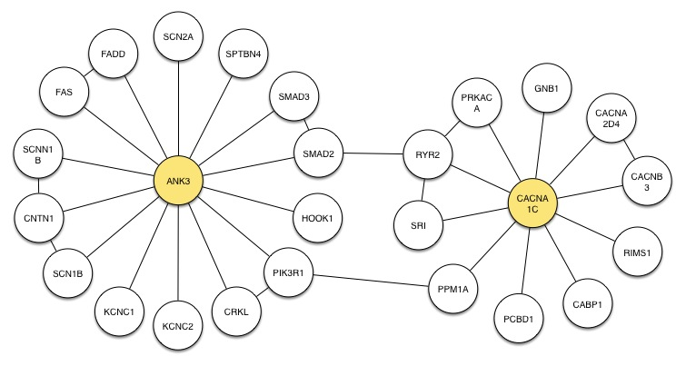

#Graph Visualization in JS

Graphs have been used to model problems since the 1700s when Euler solved the
problem of the
[Seven Bridges of Königsberg](http://en.wikipedia.org/wiki/Seven_Bridges_of_Königsberg)
by using a graph.
(This problem involves finding a path through the city that only crosses
each bridge once, which Euler proved impossible.)
Graphs are convenient for representing pairwise relationships in
data as in social networks and biological networks.
And, are also the foundation of approaches that exploit pairwise relationships in
computation, such as graph databases (see [neo4j](http://www.neo4j.org) and [titan](http://thinkaurelius.github.io/titan/))
and computational approaches such as those in [GraphLab](http://graphlab.org/).
Visualization of graphs allow us to see the structure of graphs and to understand
how objects are related within them.

This repository documents an exploration of graph visualization using three
JavaScript libraries: cytoscape.js, d3.js, and sigma.js.
Two of these, cytoscape.js and sigma.js, are dedicated to graph visualization,
while D3 is a general visualization framework.
Each also allows us to attach events so that we can interact with the visualization.

##An example graph

For the examples, I use a biological graph derived from two genes that had, at
one point, been identified with genetic modifications in people with
Bipolar Disorder.
The graph itself is the neighborhood of the proteins for these genes in an old
instance of the [MiMI database](http://mimi.ncibi.org) at the University of Michigan.
This is the graph I originally drew by hand – the proteins for the two genes are
colored yellow:

In this graph, the vertices represent proteins, and the edges represent molecular
interactions (primarily molecular binding) between proteins.

The goal of our exploration, for now, is to get something that looks like this
hand drawn layout using the different libraries.

##Following along

Rather than make a single project, there is an independent subdirectory for each
library, and the corresponding document in the `doc` directory describes how
to start with each library separately.
In each subdirectory I have two files `examplegraph.js` and `examplegraph.html`.
You may want to peak at the `html` files, since I'll mostly go through the JavaScript.
I use `npm` to pull down the libraries as local dependencies, so you'll need to
have it installed to follow along.

- [Cytoscape.js](./cytoscapejs.md)
- [D3.js](./d3graph.md)
- [Sigma.js](./sigmajs.md)

##Getting started

*All OS specific instructions assume a Unix-based system, and are written based on
using Mac OS X.*

To get started, create a directory `graphviz` as a sandbox, in which you can
create a subdirectory for each project.
At the command line run the commands

    mkdir graphviz
    cd graphviz
