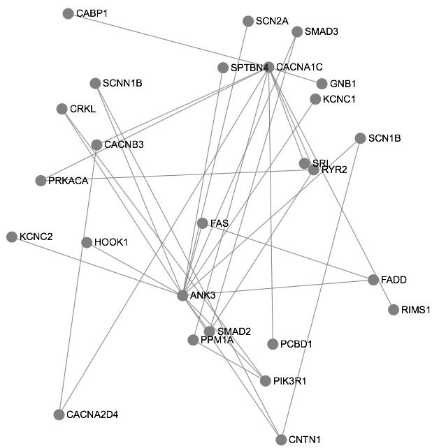
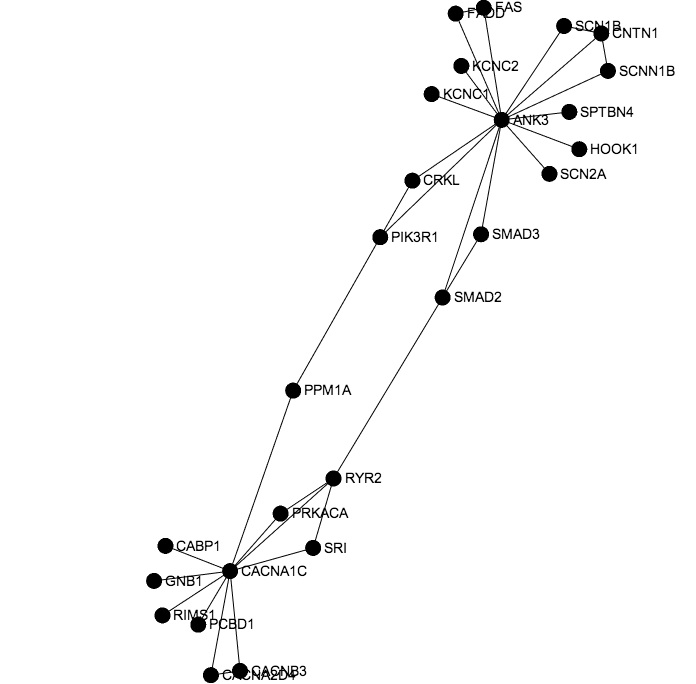

#Visualizing graphs with sigma.js

Sigma.js is a JavaScript graph visualization API that uses Canvas/WebGL for
drawing the graphs.
It was created by Alexis Jacomy at
[SciencesPo Media Lab](http://www.medialab.sciences-po.fr) and allows basic
visualization and interaction.

##Getting Started

*All OS specific instructions assume a Unix-based system, and are written based on
using Mac OS X.*

To get started, we'll create a directory `sigmajs` as a sandbox, and do a local
install of sigma.js using `npm`.
So, at the command line run the commands

    mkdir sigmajs
    cd sigmajs
    npm init
    npm install sigma --save-dev

The `npm install` will place sigma.js in the local `node_modules` directory, with
minified code in the `build` subdirectory – so running `node`, you can
require `sigma.min.js` to use it.

##A Basic Page

    <!DOCTYPE html>
    <html>
    <head>
      
    </head>
    <body>
      

      
      
      
    </body>
    </html>

##A session
Each visualization is attached to an instance of `sigma`,

    var s = new sigma('graph-container');

The argument indicates the DOM component to which the graph will be rendered.
By default, this uses a renderer that uses Canvas, which otherwise would have to
be specified [separately](https://github.com/jacomyal/sigma.js/wiki/Public-API).

##The graph

A graph is a list of nodes and edges.
Minimally, a node needs to have an `id` as in

    { id: 'n1' }

but, practically, it needs a location and size to be rendered

    { id: 'n1', label: 'ANK3', size:1, x:Math.random(), y:Math.random() }

In this case, we randomly place the nodes of the graph as it is created.
An edge also has an `id` along with id's for a `source` and `target` node:

    { id: 'e1', source: 'n1', target: 'n2' }

We can either combine these into a JSON object, and read them into the session
graph like

    s.graph.read({
      nodes: [
        { id: 'n1', label: 'ANK3', size:1, x:Math.random(), y:Math.random() },
        { id: 'n2', label: 'SCN2A', size:1, x:Math.random(), y:Math.random() }
      ],
      edges: [
        { id: 'e1', source: 'n1', target: 'n2' }
      ]
    });

Or, we can add them individually to the graph using

    s.graph.addNode({ id: 'n1', label: 'ANK3', size:1, x:Math.random(), y:Math.random() });

and

    s.graph.addEdge({ id: 'e1', source: 'n1', target: 'n2' });

which can be chained together.

The color of the nodes can be set individually, setting the `color` property
for each.
Or, globally as in

    s.settings({
      nodeColor: 'default',
      defaultNodeColor: 'grey'
    });

which gives the following appearance (the layout being determined by the calls to
`Math.random()`):

##Force directed layout

A force-directed layout is an iterative process to move the vertices relative to
one another by simulating forces along edges and between the vertices.
The implementation in sigma.js is started by running

    s.startForceAtlas2();

The layout will eventually converge so that eventually iterations will only move
the nodes imperceptibly.
The sigma.js implementation does not terminate, and has to be stopped with
a second function call

    s.stopForceAtlas2();

after enough time has passed.
How long is enough depends on the graph, so it is probably better to setup an
event handler so the user can stop the layout --- for now, my code just lets it run.
The graph will settle on something that looks somewhat like the following

##Finding sigma.js

- [sigma.js website](http://sigmajs.org)
- [sigma.js wiki](https://github.com/jacomyal/sigma.js/wiki)
- [sigma.js github repo](https://github.com/jacomyal/sigma.js)
